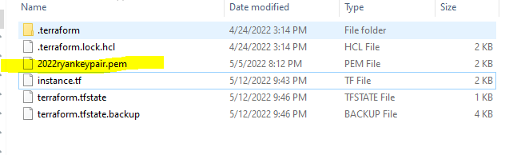
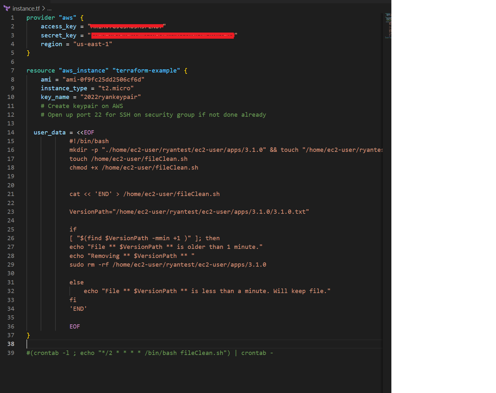

# Bash File CleanUp Demo

# Introduction & Goals
- The goal of the project was to use infrastructure-as-Code to create an ec2 instance, a sample file that would host the location of an application, and a bash cleanup script that can be called through a cronjob.

# Application
- "Terraform is an open-source infrastructure as code software tool created by HashiCorp. Users define and provision data center infrastructure using a declarative configuration language known as HashiCorp Configuration Language, or optionally JSON"
- I used Visual Studio Code to run the HCL script to deploy infrastructure to AWS.
- You will need to create a keypair on AWS and put it in the same folder as your .tf file. This will be used to automatically ssh & run your scripts on the EC2 instance.

# Script
- Create a .tf file. First you'll need to input your access keys and EC2 instance information. This is where you will type in the name of the keypair. On your default security group, open up port 22 so that you can SSH into the instance. 
- After this we'll be using bash for our post-deployment script. 
- The first line creates a directory & a file. The second line creates a second file that will be used to automatically clean out old apps. It has to be modified to be an executable, hence chmod +x.
- After the file is created, I added the logic to the script. This is just a random example, but it will remove the 'apps' directory if it's older than a minute (according to modified time). Else, it will keep the file. 
- In a real scenario, I would have a script that would remove files once a day if the version is no longer used. For example, there could be a database setting that would show if clients use the version. If they aren't using the version, then it can be removed to save space.
- I added the cronjob manually. I had to ssh into the server and execute one line: (crontab -l ; echo "*/1 * * * * /bin/bash fileClean.sh") | crontab - 
- Normally this would be setup in AWS on something like Lambda so that the cronjob could be used on any server.

# Run Script
- To run script: terraform apply --auto-approve
- To undo deployment: terraform destroy
- If the deployment is successfull, you will see that the EC2 is running on AWS

# Conclusion
- Terraform allows you to deploy a fully configured server within minutes of running the script. Since Terraform is open-source, it can be used universally on any cloud platform. 
